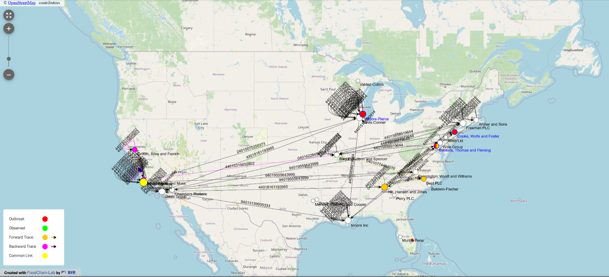

# FCL Converter

The FCL Converter is a tool designed to convert Electronic Product Code Information Services (EPCIS) V2.0 standard
documents into a format that FoodChain-Lab can use for visualizing supply chain data. This is especially useful in
industries like food and pharmaceuticals, where tracking products is crucial for safety and compliance.

## Purpose and Functionality

The converter takes EPCIS V2.0 JSON documents, which contain detailed supply chain event data, and transforms them into
a compatible format for [FoodChain-Lab](https://foodrisklabs.bfr.bund.de/foodchain-lab/). This platform, developed by the German Federal Institute for Risk Assessment (
BfR), helps analyze and visualize supply chain networks, particularly during foodborne disease outbreak investigations.
By enabling this conversion, the FCL Converter supports better decision-making and risk management in supply chains.

EPCIS captures compliance-related data (e.g., organic certification, safety checks). FoodChain-Lab can analyze this to
verify adherence to EU food safety laws, providing actionable insights for regulators and stakeholders—beyond its
current basic tracing scope.

## Technical Foundation

The FCL Converter is built using a modified version of the [EPCPyYes](https://gitlab.com/serial-lab/EPCPyYes), a Python
module for working with EPCIS data. This library has been updated to align with the latest EPCIS JSON standard, ensuring
the converter can handle current data formats accurately. This foundation allows for efficient parsing and generation of
EPCIS-compliant data, which is then adapted for FoodChain-Lab's needs.

## Usage

` python fcl_converter.py example/example_epcis.json example/example_fcl.json`

## Example Result
Using EPCIS data, FoodChain-Lab gains speed, depth, and real-time analytical power, transforming it into a more
effective tool for outbreak response and food safety analysis. This upgrade builds on its strengths while addressing
limitations in data standardization and timeliness, positioning it as a leader in global food traceability.

## Reference

[1] [EPCPyYes](https://gitlab.com/serial-lab/EPCPyYes)

[2] [FoodChain-Lab](https://foodrisklabs.bfr.bund.de/foodchain-lab/)